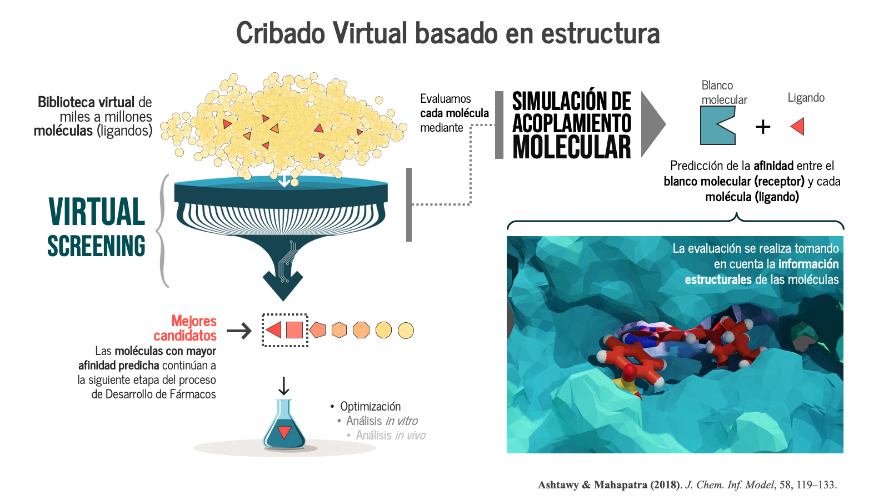
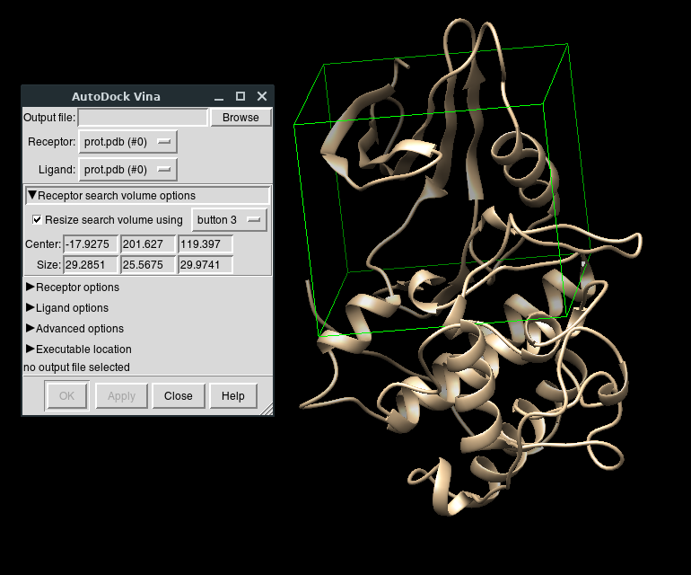

# Cribado Virtual con Smina
Anteriormente utilizamos Autodock para realizar Acoplamiento molecular. Para hacer cribado molecular, usaremos Smina,  
otro software de Acoplamiento Molecular que funciona de manera más rápida.  ***Para esto, es muy importante haber terminado los cursos de Datacamp de Shell  y Bash Scripting***

  
> Créditos: Joel Ricci

Para empezar, vamos a crear un directorio de trabajo y activar el ambiente *dock*:
  ```
cd Desktop
mkdir wd_vs
conda activate dock
 ``` 

## Paso 1: Obtención y preparación de las moléculas
Vamos a descargar las moléculas para trabajar
- Proteína: [1fin_prot.pdb](https://raw.githubusercontent.com/jRicciL/Taller_Simulacion_Molecular/master/resurces/vs/1fin_PROT.pdb)
- Ligandos: [20 ligandos en un solo archivo SMILES, cada línea es un ligando](https://raw.githubusercontent.com/jRicciL/Taller_Simulacion_Molecular/master/resurces/vs/cdk2_sample.smi)

### Preparación de los ligandos
Para guardar la información de los ligando, vamos a crear una carpeta y luego usar *obabel*
```
mkdir ligands
obabel -ismi cdk2_sample.smi -omol2 -O ligands/ -m --gen3d -p 7
```
> La bandera -m permite que Obabel identifique que trabajamos con multiples moléculas

Entramos a la carpeta de ligandos e inspeccionamos
```
cd ligands
ls -l
```

Ahora, vamos a crear un archivo llamado *rename_ligand.sh* para cambiar el nombre de los archivos de ligando. Para esto, abriremos nuestro editor de texto favorito y escribimos lo siguiente:
```
for i in *; 
do 
	name=`head -n 2 $i | tail -n 1`; 
	mv $i $name.mol2; 
done
```
Ejecutamos nuestro script usando:
```
bash rename_ligand.sh
```
>Vuelve a inspeccionar los archivos en la carpeta

Ahora, prepararemos el archivo PDBQT de cada uno de los ligando utilizando *obabel* en lugar de *prepare_ligand4.py* 

```
cd ../
mkdir ligs_pdbqt
obabel -imol2 ligands/* -opdbqt -O ligs_pdbqt/.pdbqt -m
```
Con esto, los ligandos están listos

### Preparación de receptor
Similar al Docking, vamos a usar pdb2pqr para eliminar aguas y preparar la proteína a pH 7
```
pdb2pqr30 --ff='AMBER' --ffout='AMBER' --with-ph=7.0 \
	--drop-water --keep-chain --pdb-output prot.pdb \
	1fin_PROT.pdb pqr_file.pqr
```

Posteriormente, vamos a utilizar [CASTP](http://sts.bioe.uic.edu/castp/index.html?2pk9) para identificar el sitio activo de la proteína. Seguido de esto, vamos a abrir el archivo *prot.pdb* en UCSF Chimera

En Chimera, vamos a ir *Tools > Surface/Binding Analysis  > Autodock Vina* y damos check en la caja que dice "Resize search volume" con esto, puedes dibujar el espacio de búsqueda para el Docking
  

Al igual que en Autodock, es importante guardar las dimensiones y coordenadas de la caja a mano, en mi caso las dimensiones fueron:
```
Centro:
x= -17
y= 201
z= 119

Dimensiones:
x= 29
y= 25
z= 29
```
>Si prefieres, puedes utilizar Autodock Tools para obtener la información del espacio de búsqueda, sin embargo, en Autodock la resolución de las dimensiones es 0.375 Angstroms y en Vina/Smina/Chimera, es de 1 Angstrom

Para terminar de preparar el receptor, otra vez usaremos *obabel* 
```
obabel -ipdb prot.pdb -xr -opdbqt -O prot.pdbqt
```

## Paso 2: Prueba de docking con Smina

Para ver como ejecutar Smina, utilizar en el ambiente *dock*:
```
smina --help
```
> Aqui viene la información de los inputs y flags usados en Smina, es importante leerlos para comprender los scripts que haremos a continuación

De prueba, haremos un Docking singular utilizando Smina, como se vio en el comando anterior, se requieren varios inputs a la vez, para facilitarnos la vida, vamos a crear un script con el nombre *run_smina_dock.sh* utilizando nuestro editor de texto favorito y ahí dentro, escribiremos: 
```
smina -r prot.pdbqt \
      -l ligs_pdbqt/CS1.pdbqt \
      -o CS1_docked.pdbqt \
      --log CS1_docked.log \
      --center_x -16 \
      --center_y 205 \
      --center_z 117 \
      --size_x 21 \
      --size_y 22 \
      --size_z 22
```
> Ejecutamos con bash run_smina_dock.sh

En el archivo *.log* podemos ver resumida la información del Dock realizado y el archivo *.pdbqt* resultante lo podemos observar en Chimera o AutodockTools

## Paso 3: Preparación y ejecución de Virtual Screening (Cribado Virtual) con Smina

Después de haber llevado a cabo una prueba invidual, vamos a correr nuestro Cribado Virtual utilizando Smina en un ciclo for. Empezamos creando un directorio para la salida.
```
mkdri docks
```
También, vamos a crear un archivo de configuración de smina. Con un editor de texto, vamos a crear un archivo llamado *dockings_smina.conf*
```
# Nombre del archivo del receptor
receptor = prot.pdbqt
# Exhaustividad de búsqueda
exhaustiveness = 4
# Posición del centro del grid (en A)
center_x = -17
center_y = 201
center_z = 119
# Dimensiones del espacio de búsqueda (en A)
size_x = 29
size_y = 25
size_z = 29
# Número de cpus
cpu = 2
# Scoring a utilizar
scoring = vina
```
> Como nota, las funciones de scoring que se pueden utilizar son: 
ad4_scoring
default
dkoes_fast
dkoes_scoring
dkoes_scoring_old
vina
vinardo


Vamos a crear nuestro ciclo for dentro de un script de Bash, lo llamaremos *run_smina_screening.sh*
```
for lig in ligs_pdbqt/*.pdbqt;
	do 
		name=`basename $lig .pdbqt`;
		echo "Ejecutanto para $name";
		smina --config dockings_smina.conf --ligand $lig \
			 --log docks/$name.log --out docks/"$name"_dk.pdbqt;
	done
```
Ejecutaremos nuestro nuevo script con:
```
bash run_smina_screening.sh
```
>Esto puede tomar unos minutos

Vamos a guardar los resultados de la mejor pose de cada ligando en un archivo *.csv*. Para esto vamos a extraer de cada archivo *log* la línea que empieza con 1 y eliminamos el resto de los carácteres de la línea. Vamos a crear el siguiente script llamado *summarize_vs.sh*
```
echo "ligand,score" > vs_results.csv
for dklog in docks/*log;
do 
	echo "Procesando ligando $dklog";
	result=`grep '1    ' -m 1 $dklog | tr -s ' ' |  cut -d ' ' -f2`;
	name=`basename $dklog .log`;
	echo "$name, $result" >> vs_results.csv;
	echo $result;
done
```

Finalmente, vamos a observar los resultados del Cribado Virtual:
```
cat vs_results.csv
```

> Written with [StackEdit](https://stackedit.io/). by Javier Wong
